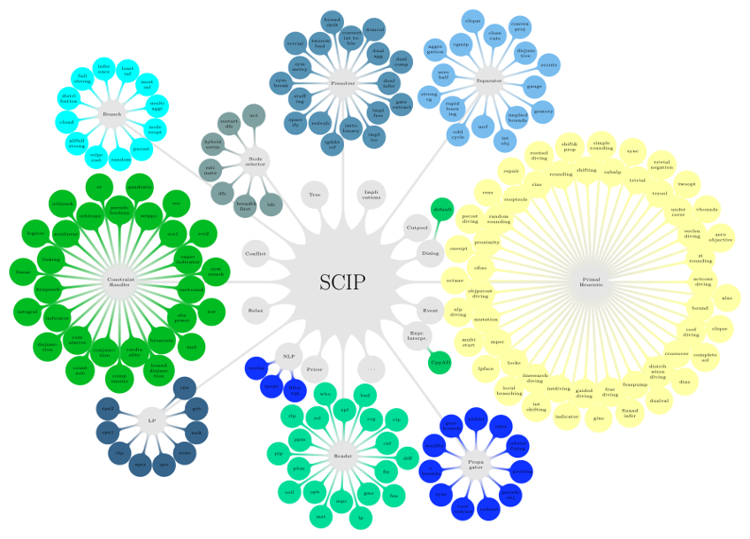

###########
Why SCIP?
###########

.. note:: This page is written for a user that is primarily MILP focused.

"Why SCIP?" is an important question, and one that is in general answered by performance claims.
To be clear, SCIP is performant. It is one of the leading open-source solvers.
It manages to be competitive on a huge array of benchmarks, which include but are not limited to,
mixed-integer linear programming, mixed-integer quadratic programming, mixed-integer semidefinite
programming, mixed-integer non-linear programming, and pseudo-boolean optimization.
This page will attempt to answer the question "Why SCIP?" without relying on a performance comparison.
It will convey the scope of SCIP, how the general structure of SCIP works,
and the natural advantages (also weaknesses) SCIP has compared to other mixed-integer optimizers.

So, why SCIP? SCIP (Solving Constraint Integer Programs). The two main points are that SCIP is likely
much more general than you expect, and it also likely provides easy to use functionality
that you didn't know was possible.

Differences to Standard MILP Solvers
====================================

SCIP (Solving Constraint Integer Programs) is a constraint based solver, it is not a pure MILP solver.
This claim is thrown around frequently, but it is difficult to actually understand the difference and
the positive + negative outcomes this has on the solving process.
Let's consider a stock standard MILP definition.

.. math::

    &\text{min} & \quad &\mathbf{c}^{t}x \\
    &\text{s.t.} & & \mathbf{A}x \leq \mathbf{b} \\
    & & & x \in \mathbb{Z}^{|\mathcal{J}|} \times \mathbb{R}^{[n] / \mathcal{J}}, \quad \mathcal{J} \subseteq [n]

When looking at such a problem, one probably thinks of matrices, e.g., the coefficient matrix :math:`\mathbf{A}`.
When thinking of the solving process, one probably then thinks of adding cuts and branching. Adding cuts could then
be represented by adding additional rows to the problem, and branching represented by creating two subproblems
with different variable bounds (the bounds also maybe represented as rows). SCIP's design is inherently different
from such an approach. SCIP considers each constraint individually as opposed to taking such a matrix view.

What are the ramifications of this choice? A clear negative ramification is that some matrix operations, many of which
are important for quick MILP solving, are less clear on how they'd be implemented and are likely to be less efficient.
A clear positive ramification is that now the jump to handling non-linear constraints is easier.
If there is no restriction to such a matrix representation, and each constraint is handled individually,
then why can the constraints not actually be arbitrary? That's exactly one of the core strengths of SCIP!
This can be seen in the :doc:` lazy constraint example </tutorials/lazycons>`, where a single constraint
is constructed that will ultimately create up to exponentially many additional linear constraints
dynamically in the solving process. To emphasise this point further, one of the most common
constraint handlers in SCIP is the integrality constraint handler.
It is responsible for telling the solver how to enforce integrality for integer variables with currently
fractional solution. That is, a constraint handler enforces integrality, and therefore it can be transparently
decided when to enforce integrality during the solving process.

Most probably, when reading the above, an assumption has been made that when solving MILPs one needs access
to an LP solver for solving the LP relaxations. SCIP is unusual here on two points. Firstly, SCIP
does not have a built-in LP solver, but rather it has an LP interfaces that works with a huge variety of
other external LP solvers. This has the huge benefit of separating the reliance on a single LP solver,
and allows user to change the underlying LP solver if they wish. This also has a huge downside however,
which is that communication with the LP solver is now more computationally costly, and some information from the
LP solver may be inaccessible. The second unusual point is that SCIP does not need an LP solver to
prove globally optimal solutions. There is an entire field of study parallel to MILP, namely CP
(constraint programming). In CP, the problems are solved using propagation to tighten variable domains,
and the splitting of the original problem into subproblems, i.e., branching.
That is not to say that one should avoid LPs when solving MILPs. In the vast majority of cases
the use of LP relaxations is extremely important for good computational performance.

Now on to the final assumption. Above we mentioned that SCIP does not need to rely on an LP solver, and that
it can use techniques from the CP community. What if we wanted to use another relaxation technique however?
For instance some convex relaxation, but necessarily a linear relaxation? This can be done in SCIP!
The functionality exists to write your own relaxator, and decide on what the relaxation of the problem should
look like at each node of the tree.

SCIP is therefore a software at the intersection of mixed-integer programming and constraint programming.
Its technique of treating the optimization problem as a set of constraints as opposed to an array of
inequalities makes it able to naturally handle a wider class of optimization problems.

Modular Design and Plug-Ins
===========================

Maybe the biggest advantage of SCIP over other solvers, is for users in the MILP community that
want to influence the default solving process in some way. Let's take a look at the following graphic:

This graphic shows the plug-in structure of SCIP. In the center we have the core of SCIP. Ignore this for now,
however, and let's look at one of the various flowers of the graph. For instance, let's take
the primal heuristic flower, i.e., the yellow nodes on the right. Let's then take a look at the petals
(nodes). These have names corresponding to different heuristics. For example, there's feaspump, rins,
random rounding, and fracdiving. The beauty of the structure of SCIP is that all these primal heuristics
share a common interface. Why is this important? Because writing and including your own heuristic means
you just need to implement a small and well-defined set of functions! These functions have plenty of
documentation online, examples in Python are given in this website, and the design insulates you
from having to actually dive into the core. It is therefore incredibly accessible for MIP practitioners
and researchers to use SCIP for their own custom algorithms.

.. note:: Because we are using Python, communication between different self-written plug-ins is easy.
  One would need to make them aware of one another when creating them, and then their Python
  representation can be queried as desired.
